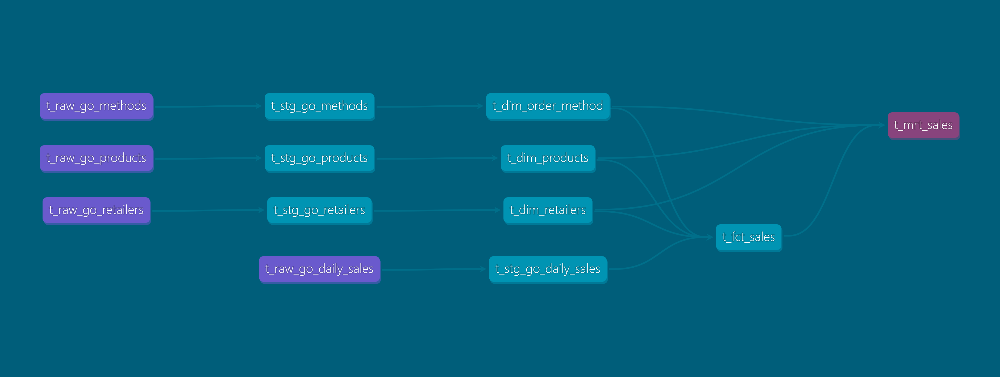

[](https://github.com/manz01/dbt-core-sample-duckdb/actions/workflows/pylint.yml)
[](https://sonarcloud.io/summary/new_code?id=manz01_dbt-core-sample-duckdb)
<br>


> **_NOTE:_**  ✅ **CI/CD Integration**: This repository now includes static code analysis via [Pylint](https://pylint.pycqa.org/) and quality gate validation via [SonarCloud](https://sonarcloud.io/summary/new_code?id=manz01_dbt-core-sample-duckdb)..


# Go Sales DuckDB dbt Sample Project
This repository contains a sample dbt project that demonstrates how to model and transform the GO Sales IBM sample data using dbt (data build tool) with DuckDB as the database engine. 

### Document Control
|Version|Date|Author|Description of Change|
|-|-|-|-|
|1.0|2025-05-18|Manzar Ahmed|Initial Version|
|1.1|2025-06-12|Manzar Ahmed|Added DET and MRT model sections|
|1.2|2025-06-22|Manzar Ahmed|Added section with dbt docs|
|1.3|2025-06-23|Manzar Ahmed|Added section High level design|

## Table of Content
- [1. Background](#1-background)
- [2. High Level Design](#2-high-level-design)
- [3. Run dbt Models](#3-run-dbt-models)
  - [3.1. Raw Models](#31-raw-models)
  - [3.2. Staging Models](#32-staging-models)
  - [3.3. Detailed Models (DET)](#33-detailed-models-det)
  - [3.4. Mart Models (MRT)](#34-mart-models-mrt)
- [4. Visualize Lineage with dbt Docs](#4-visualize-lineage-with-dbt-docs)

>NOTE: This sample project utlizes the [GO Sales IBM sample data](https://dataplatform.cloud.ibm.com/exchange/public/entry/view/dcf7b09bd340e6ff9a2d1869631f3753) to demonstrate dbt modeling techniques. It is designed to be run with DuckDB as the database engine, but can be adapted for other engines like Snowflake, BigQuery, or Redshift with minor modifications to the dbt profiles and SQL syntax. The GO Sales dataset is a fictional retail dataset that simulates sales operations for a global retailer, and available under the MIT License. 

## 1. Background
The GO Sales IBM sample data is a fictional retail dataset designed to demonstrate business analytics, reporting, and data warehousing techniques. It simulates sales operations for a global retailer and contains various interconnected tables that model business domains.

**Feature datasets and columns**

1. Go product: Information on the ID and quantity of sale items
* Retailer code
* Product number
* Date
* Quantity: Number of items

2. Go Daily Sales:
* Retailer code
* Product number
* Order Method Code: Sequential numerical code for order method type
* Date
* Quantity: Number of items
* Unit Price: Regular price of item
* Unit Sale Price: Sales price of item

3. Go Methods:
* Order Method Code: Sequential numerical code for order method type
* Order Method Type: "Fax", "Telephone", "Mail", "E-mail", "Web", "Sales visit", "Special", "Other"

4. Go Products:
* Product number
* Product line: "Camping Equipment", "Mountaineering Equipment", "Personal Accessories", "Outdoor Protection", "Golf Equipment"
* Product type:  "Cooking Gear", "Tents", "Sleeping Bags" and more
* Product: "TrailChef Water Bag", "TrailChef Canteen", "TrailChef Kitchen Kit" and more
* Product brand: "TrailChef", "Star", "Hibernator" and more
* Product color: "Clear", "Brown", "Silver" and more
* Unit cost: Cost to supply unit in shop
* Unit price: Regular price of item

5. Go Retailers:
* Retailer code
* Retailer name
* Type: Type of retailer store
* Country: Retailer store's country of origin

## 2. High Level Design

The dbt-core project follows a **layered design architecture** that systematically structures data transformations through a series of increasingly refined stages. This layered approach promotes modularity, reusability, and transparency in the data pipeline.


### Layer Breakdown:

1. **Raw Layer (`raw`)**  
   - This layer ingests raw data directly from the **MySQL DB instance**.
   - It performs minimal transformation (if any), mainly focused on standardizing data types and storing source extracts as-is.

2. **Staging Layer (`stg`)**  
   - This layer acts as a clean-up zone where raw data is normalized, renamed, and prepared for further transformation.
   - Typical operations include renaming columns to snake_case, handling nulls, and deduplicating rows.

3. **Detailed Layer (`det`)**  
   - This is the business logic layer, where transformations are applied to derive meaningful metrics and dimensions.
   - It includes joins, surrogate key generation, Slowly Changing Dimensions (SCD), and other enrichment logic.

4. **Mart Layer (`mrt`)**  
   - This final layer presents the data in a business-consumable format.
   - It aggregates and filters data for reporting, dashboards, and analytics use cases.

Each layer feeds into the next, ensuring that transformations are traceable and logically separated. 


## 3. Run dbt Models

**Create Aliases & Global Vars**

```sh
export DBT_PROJ_DIR='/home/u001/dbt-core-sample-duckdb'
export DBT_PROFILE_DIR='/home/u001/dbt-core-sample-duckdb'
export PYTHONPATH=$DBT_PROJ_DIR
```

**Create dbt run go sales alias shorthand**
```sh
alias dbt_run_go_sales='dbt run --project-dir $DBT_PROJ_DIR --profiles-dir $DBT_PROFILE_DIR --target go_sales'
```
### 3.1. Raw Models

```sh
dbt_run_go_sales --select tag:GO_SALES_RAW
```

### 3.2. Staging Models
 
```sh
dbt_run_go_sales --select tag:GO_SALES_STG
```

### 3.3. Detailed Models (DET)

```sh
dbt_run_go_sales --select tag:GO_SALES_DET
```

### 3.4. Mart Models (MRT)

```sh
dbt_run_go_sales --select tag:GO_SALES_MRT
```

## 4. Visualize Lineage with dbt Docs

dbt provides an interactive lineage graph that visually represents how models are built from raw data through staging, transformation, and into marts. This helps developers, analysts, and stakeholders understand data dependencies and relationships.

To generate and view the lineage diagram:

**Step 1: Generate dbt docs**
```sh
dbt docs generate --project-dir $DBT_PROJ_DIR --profiles-dir $DBT_PROFILE_DIR --target go_sales
```

**Step 2: Serve dbt docs**

```sh
dbt docs serve --project-dir $DBT_PROJ_DIR --profiles-dir $DBT_PROFILE_DIR --target go_sales
```

This will start a local web server and open a browser where you can explore:

- Model-level documentation
- Column-level metadata
- Tags and descriptions
- The DAG (Directed Acyclic Graph) lineage diagram

The diagram includes paths from:

- Raw sources (e.g., t_raw_go_daily_sales)
- Through staging models (e.g., t_stg_go_daily_sales)
- Into dimensional tables (e.g., t_dim_products)
- Finally into fact and mart tables (e.g., t_fct_sales → t_mrt_sales)

The following diagram provides a visual representation of the dbt model lineage for the GO Sales project, illustrating how raw data flows through staging, dimension, fact, and mart layers:

